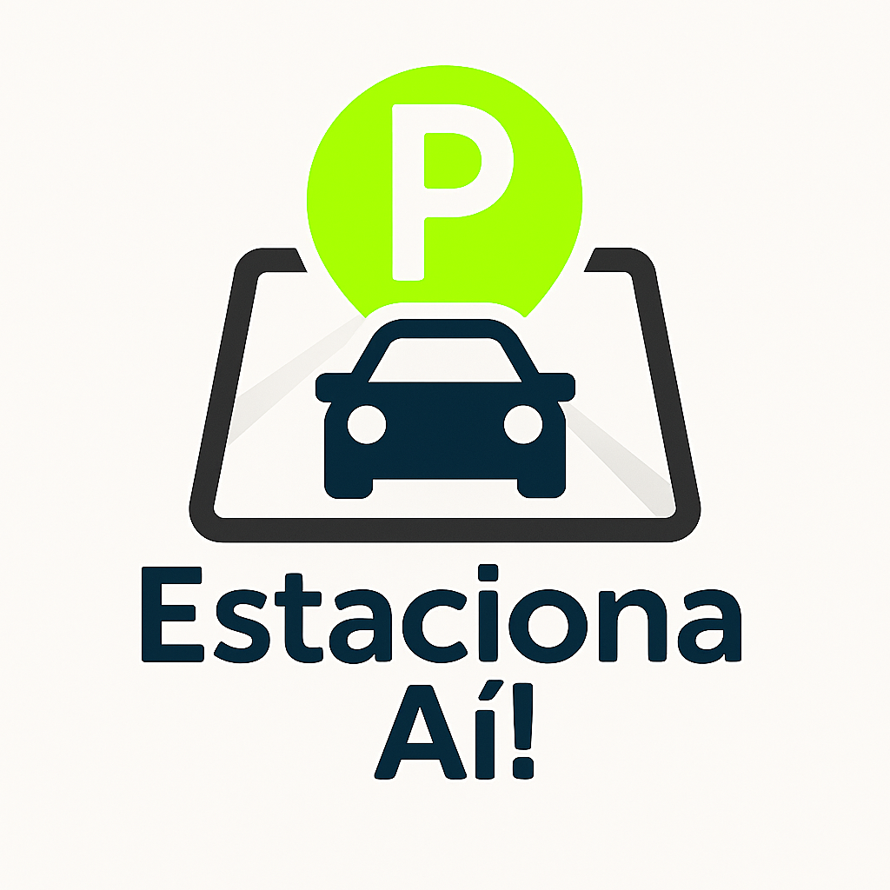

# 🚗🅿️ Estaciona Aí

Aplicativo web para gerenciamento de vagas de estacionamento, desenvolvido como projeto final do curso Fullstack Jr. da +PraTi.


## 📸 Preview



## 🚀 Tecnologias

- React
- Vite
- JavaScript
- ESLint
- Node.js

## 📦 Instalação

```bash
git clone https://github.com/Govaski/Estaciona-Ai.git
cd estaciona-ai
npm install
npm run dev


📌 Status do Projeto

🚧 Em desenvolvimento

